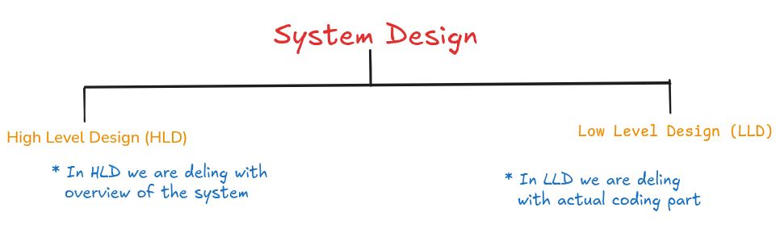

# System Design  

Hello 👋, **welcome**  
 This repository is all about understanding the core concepts of ***System Design***. You'll find detailed, original explanations on every topic to make complex ideas simple and clear.

**_Give me a ⭐, If this repository is helpful for you_**.

**Before we deep dive into the actual content we'll go through the roadmap first, which will help us to understand the important topics for system design .**  

**Prerequities:**  _You should familer with development and you must have some basic understand of these topics : `Networking`, `DBMS`, `Any Programming Language & It's Baisc Concepts`, `OS`_  

Before designing any system we should know about `functional` & `non-functional` requirements for the system that we are going to design later.  

**Example :** Let say we are designing `netflix` system, so we must know about it's functional requirements and non-functional requirements.  

**Functional Requirements :** It defines the features that system is going to have.  
-    Functional Requirement for `netflix`:  

     -    ***Users should able to register and login***
     -    ***User should able to buy subscription***
     -    ***User should be able to play and pause videos*** 

**Non-Functional Requirements :** It defines the quality of the system or how it will perform.
-    Non-Functional Requirements for `netflix`:  

     -    ***secure system / with authorization & authentication***
     -    ***low latency for videos***
     -    ***scalable system***

### [HLD (High Level Design) ](./docs/HLD/README.md):  

It's like an architect's initial blueprint for a **house**, showing the different **rooms**, their **placement**, and how they **connect**, but not the specific type of ***wiring*** or ***plumbing*** fixtures in each **room**.

-    **Fundamentals :**  

     -    _serverless v/s serverful_
     -    _horizontal v/s vertical scalling_
     -    _What are threads_
     -    _What are pages_
     -    _How does internet work_  

-    **[Database](https://github.com/Afzal14786/SQL) :**  

     -    _SQL v/s no-sql Dbs_
     -    _In memory Dbs_
     -    _Data Replication & migration_
     -    _Data partitioning_
     -    _Sharding_

-    **Consistency & Availability :**

     -    _Data consistency & its level_
     -    _Isolation & It's level_
     -    _CAP theorem_

-    **Cache :**

     -    _What are cache?_ **(Radis, Mamcahed)**
     -    _Write Policies:_ **Write back, through & around**  
     -    _Replacement policies_ **LFU, LRU, segmented LRU, etc**
     -    _Content Delivery Network (CDN)_

-    **Networking :**

     -    _TCP v/s UDP_
     -    _What is http (1/2/3) and https_
     -    _Web Sockets_
     -    _WebRTC & Video Streaming_

-    **Load Balancers :**

     -    _Load balancing algorithms_ **stateless & statefull**
     -    _Consistent Hashing_
     -    _Proxy and Reverse Proxy_
     -    _Rate Limitation_

-    **Message Queues :**

     -    _Asynchronous Processing_ **(Kafka, RabbitMQ)**
     -    _Publisher-Subscriber model_

-    **Monolithic v/s Microservices :**

     -    _Why microservices_
     -    _Concepts of single point failure_
     -    _Avoiding cascading failure_
     -    _Containerization_ **(Docker)**
     -    _Migrating to Microservices_

-    **Monitoring & Logging :**

     -    _Monitorring metrics & Logging events_
     -    _Anomaly Detection_

-    **Security :**  

     -    _Token for `auth`_
     -    _SSO & OAuth_
     -    _Access control lists & rule engines_
     -    _encryption_

-    **System Design TradeOffs :**

     -    _push v/s pull architecture_
     -    _consistency v/s availability_
     -    _SQL v/s no-sql DBs_
     -    _Memory v/s latency_
     -    _Throughput v/s latency_
     -    _Accuracy v/s latency_

-    **Practicing System Design by Building Large Systems Like :**

                  

****
 
 

### Low Level Design (LLD)  
It's the **detailed construction** plan for each **room** of the **house**, specifying the exact placement of **electrical outlets**, the type of **pipes** to be used for **plumbing**, and the **materials** for the **flooring**.  

-    **OOPs :**

     -    _Encapsulation_
     -    _Abstraction_
     -    _Inheritance_
     -    _Polymorphism_
     -    _SOLID principels_

-    **Design Patterns :**

     -    _Creational (Singletone, factory, etc..)_
     -    _Structural (Proxy, Bridg, etc...)_
     -    _Behavioral (strategy, command, observer etc...)_

-    **Concurrency & Thread Safety :**

     -    _Thread Safe Injection_
     -    _Locking Mechanisms_
     -    _Producer-Consumer_
     -    _Race Conditions & Synchronizations_

-    **UML Diagrams :**

     -    _Class Diagrams_
     -    _Component Diagrams_

-    **APIs :**

     -    _APIs Design_
     -    _req/res object modeling_
     -    _Versioning & Extensibility_
     -    _Clean Code Principel : **DRY(Do Not Repeat), SRP, etc...**_
     -    _Avoiding God Classes_

-    **Common LLD Problems :**

     -    ***Design a Tic-Tac-Toc or Chess Game***
     -    ***Design a Splitwise App***
     -    ***Design a Parking-Lot***
     -    ***Design a Elevator System With Multiple Lifts***
     -    ***Design a Notification System***
     -    ***Design a Food Delivery System***
     -    ***Design a Movie Booking System***
     -    ***Design a URL Shortner***
     -    ***Design a Logging Framework***
     -    ***Design a Rate Limiter***

# Table of contents  

-    **Basic Concepts**  

     -    [What is system design](#what-is-system-design)  

---

# What is system design  

