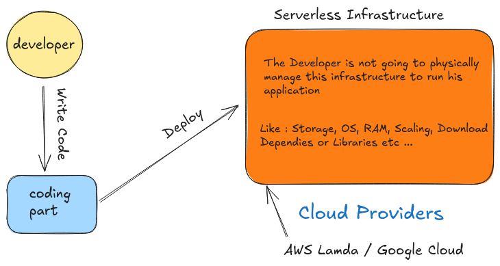

# High Level Design (HLD)  

**High-Level Design (HLD)** is the architectural blueprint for a software system. It's the **bird's-eye view** or the **macro-level** plan that outlines the entire system's _structure_, _components_, and how they _interact_ with each other without going into the _internal details_ of each component.

In this file we'll be covering most of the concepts related to `HLD` . Also I'll try to explain and share my best knowledge while learning **System Design** .  

**Fundamentals :**  

-    [serverless v/s serverful](#serverless-vs-serverful)
-    _horizontal v/s vertical scalling_
-    _What are threads_
-    _What are pages_
-    _How does internet work_  

## Serverless v/s Serverful  

### Serverless Architecture  

It is an approach to **system design** that allows `developers` to focus on writing code and deploying it without having to manage the underlying infrastructure. This serverless infrastructure is managed by the cloud service providers like **(Google Cloud, AWS Lambda, etc...)** .  

**Example:**  

  

_In the above diagram if you see the developer focus on writing the code only, and he is deploying the code in a serverless infrastructure, and the providers are **google cloud, aws lambda**_  

_In this case developer is not need to worry about the System Requirements, Storage, RAM, Scalling, Bandwidth, Installing Dependies and Libraries, Security Updates, Patches, etc..._  

_The Cloud Providers are handling all these things ._  

**Why to use Serverless Architecture:**  

-   Server allows users to communicate with an application and it's business logics, but managing the server it is time consuming and takes extra resourses . 

-   Teams have to manage the server hardware, software & security updates and patches, and backups in case of failure .

-   By adopting serverless, the developers can offload these responsibilites to a third-party providers and focus on writing application code . 

One of the most famous serverless architecture is **Function as a Service (FaaS),** where developers write the application code as a set of discrete functions. And Each function will perform a specific task when triggered by an event such as : HTTP request, incomming email . After customary stages of testing, developers can deploy their functions along with their triggers, to a cloud provider account . When a function is invoked, the cloud provider either executes the function on a running server, or, if there is no server currently running, it spins up a new server to execute the function. This execution process is **abstracted** away from the view of developers, who focus on writing and deploying the application code.  

**Serverless Architecture Comes With It's Own Advantages And Disadvantages:**  

**Advantages:**  

1.   **Cost:** Cloud providers charge you only when users use your application, you not to pay any extra amount when no one use your application .

2.  **Scalability:** Function instances are automatically created or removed in response to traffic variations, within the boundaries of concurrency limits.

3.  **Productivity:** Developers who use serverless architecture, can simply deploy their code without having to manage any servers, which helps accurate delivery cycles and rapidly scale company operations.

**Disadvantages:**  

1. **Vendor Lock-in** This is one of the most significant strategic risks. Because your functions are tightly integrated with a specific cloud provider's ecosystem (e.g., AWS Lambda, Azure Functions), migrating to another provider can be difficult and expensive. You rely on their specific APIs, authentication methods (like AWS IAM), and managed services (like DynamoDB or S3). Rewriting your application for a new platform can be a major undertaking.

2. **Cold Starts** A `cold start` occurs when your function is invoked for the first time or after a period of inactivity. The cloud provider needs to provision a container and load your code, which introduces latency. This delay, which can range from a few hundred milliseconds to several seconds, can be unacceptable for user-facing applications that require immediate responses. While providers have improved this, it remains a fundamental challenge for latency-sensitive workloads.

3. **Debugging and Monitoring Challenges** Troubleshooting is more complex in a serverless environment. Instead of a single application, you have multiple, distributed functions that are often stateless. Tracing a request as it flows through several functions and services requires specialized tools. While platforms like AWS X-Ray and Datadog exist, traditional debugging methods of attaching a debugger to a running process are not feasible. You often have to rely on analyzing logs from many different sources, which can be cumbersome.

4. **Potential for Higher Costs with Predictable Workloads** The pay-per-use model is excellent for unpredictable or spiky traffic. However, for applications with consistent, high-volume traffic, a traditional server-based model can be cheaper. With a dedicated server, you pay a flat rate regardless of how much it's used. In a serverless model, costs for a constantly running, high-traffic application can accumulate quickly and become more expensive than the equivalent provisioned server.  

5. **Function and Execution Limitations** Cloud providers impose specific limits on serverless functions to prevent abuse and ensure platform stability. These limitations can include:
    -   **Maximum Execution Duration:** A function can only run for a limited time (e.g., a maximum of 15 minutes for AWS Lambda). This makes it unsuitable for long-running processes.

    -   **Payload Size Limits:** The amount of data you can send to and receive from a function is restricted (e.g., a 6MB invocation payload limit for AWS Lambda).

    -   **Deployment Package Size:** The size of your code and its dependencies is also limited.

